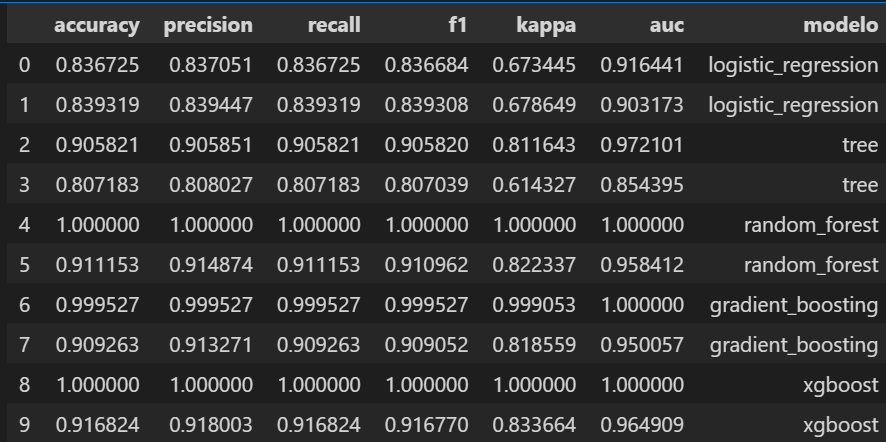

# Proyecto 8: Predicción de retención de empleados

## Explicación del Proyecto

- Esta vez, nos toca trabajar en Recursos Humanos, y enfrentarnos a uno de los mayores dolores de cabeza de cualquier empresa: la rotación de empleados. ¿Por qué algunas personas deciden quedarse mientras otras se van? ¿Será el salario? ¿Las horas extra? ¿La relación con su jefe?

- En este proyecto, usaremos datos recopilados de una empresa ficticia (¡no, no es información confidencial!) que incluye desde encuestas de satisfacción hasta métricas de desempeño y horarios laborales. La tarea consiste en desentrañar patrones, analizar tendencias y construir un modelo que pueda predecir si un empleado permanecerá o decidirá decir adiós.

- Pero esto no es solo sobre números y gráficos; se trata de entender cómo las decisiones empresariales impactan la vida de las personas y cómo, con un poco de análisis, podríamos ayudar a las empresas a ser mejores lugares para trabajar. Así, nos preparamos para explorar datos, ensuciarnos las manos con algoritmos y, quién sabe, tal vez descubrir el secreto para mantener a los empleados felices y comprometidos.

- Este proyecto va más allá de un ejercicio técnico, también es un entrenamiento toma de decisiones basadas en datos. 

## Objetivos del Proyecto

- El principal desafío de este proyecto es abordar una de las preguntas más importantes para cualquier departamento de Recursos Humanos: ¿qué empleados tienen más probabilidades de quedarse en la empresa y cuáles podrían decidir irse? Para lograr esto, el trabajo será construir un modelo de machine learning capaz de predecir si un empleado permanecerá en la empresa o decidirá marcharse. 

- El enfoque no solo será técnico. A través del análisis de los datos, identificaremos cuáles son los factores más influyentes en la retención o rotación del personal. Por ejemplo:
   - ¿Es la satisfacción laboral un predictor clave?
   - ¿Tienen más probabilidades de irse quienes trabajan largas horas o aquellos con relaciones tensas con sus jefes?
   - ¿Qué papel juegan las promociones o los aumentos de salario?

- El modelo debe ser capaz de responder estas preguntas y ofrecer predicciones precisas que puedan usarse para tomar decisiones informadas. Esto significa que, además de construir un modelo que funcione, se deben  interpretar sus resultados y proponer estrategias basadas en ellos.

## Estructura del repositorio

El proyecto está construido de la siguiente manera:

- **datos/**: Carpeta que contiene archivos `.csv` y `.pkl` generados durante la captura y tratamiento de los datos.

- **images/**: Carpeta que contiene archivos de imagen generados durante la ejecución del código o de fuentes externas.

- **notebooks/**: Carpeta que contiene los archivos `.ipynb` utilizados en la captura y tratamiento de los datos. Están numerados para su ejecución secuencial, y contenidos dentro de 3 carpetas, una para cada modelo, conteniendo las de los modelos 1 y 2:
  - `1-eda-y-gestion-de-nulos`
  - `2-encoding`
  - `3-estandarizacion`
  - `4-gesition-de-outliers`
  - `5-Modelos`
y la del modelo 3:
  - `1-eda-y-gestion-de-nulos`
  - `2-encoding`
  - `3-estandarizacion`
  - `4-gesition-de-outliers`
  - `5-desbalanceo`
  - `6-Modelos`
  
- **src/**: Carpeta que contiene los archivos `.py`, con las funciones y variables utilizadas en los distintos notebooks.

- `.gitignore`: Archivo que contiene los archivos y extensiones que no se subirán a nuestro repositorio, como los archivos .env, que contienen contraseñas.

## Lenguaje y librerías
- El proyecto fué elaborado con Python 3.12.6 y múltiples librerías de soporte:

| **Categoría**                             | **Enlace**                                                                                 |
|-------------------------------------------|-------------------------------------------------------------------------------------------|
| *Librerías para el tratamiento de datos*  | [Pandas](https://pandas.pydata.org/docs/)                                                 |
|                                           | [Numpy](https://numpy.org/doc/)                                                           |
|                                           | [pickle](https://docs.python.org/3/library/pickle.html)                                                           |
|                                                             |
| *Librerías para gráficas*                 | [Plotly](https://plotly.com/python/)                                                      |
|                                           | [Seaborn](https://seaborn.pydata.org)                                                     |
|                                           | [Matplotlib](https://matplotlib.org/stable/index.html)                                    |
|                                                                                    |
| *Librería para controlar parámetros del sistema* | [Sys](https://docs.python.org/3/library/sys.html)                                        |
|                                     |
| *Librería para creación de modelos de Machine Learning* | [scikitlearn](https://scikit-learn.org/stable/)                                         |
| *Librería para la gestión del desbalanceo* | [imblearn](https://imbalanced-learn.org/stable/)                                          |               
| *Librería para la gestión de avisos*      | [warnings](https://docs.python.org/3/library/warnings.html)                                |

## Resultados

El mejor modelo es el 3, que nos da las siguientes métricas:

En el notebook 6-Modelos del modelo3 se presentan unas conclusiones basadas en estás metricas y una serie de gráficos.

## Propuestas de Mejora:

- Corregir el overfitting.

- Analizar si al corregir el desbalanceo, se han introducido sesgos en la variable respuesta (por ejemplo si los "No" generados artificialmente tienen característias muy paredidas entre ellos, o diferentes a los que ya existían)

- Hacer un modelo predictivo basado en los duplicados que se eliminaron y comparar concluisones con este modelo.

- Introducir mejoras en el preprocesamiento (probar un tratamiento diferente de nulos y outliers y probar otros métodos de estandarización)
- 

## Autor ✒️

* **Rafael Castellot de Miguel** - [rcm89](https://github.com/Rcm89)
